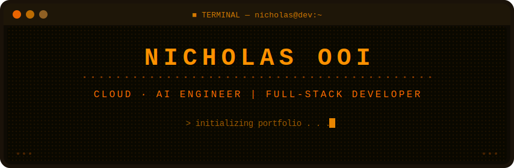

<!-- ===== DOT MATRIX TERMINAL HEADER ===== -->
<div align="center">
  
</div>

<!-- ===== TYPING ANIMATION ===== -->
<div align="center">
  <a href="https://git.io/typing-svg">
    
  </a>
</div>

<br/>

<!-- ===== ABOUT ME ===== -->

### `> cat about_me.txt`

```
╔══════════════════════════════════════════════════════════════════════════════╗
║                                                                            ║
║  I'm a Full Stack Software Developer and an OSINT Enthusiast with          ║
║  hands-on experience building production-grade applications using           ║
║  AWS, TypeScript, and React.                                               ║
║                                                                            ║
║  I specialise in cloud-native architectures, AI compliance tooling,        ║
║  and crafting intuitive web experiences — from voice-controlled form        ║
║  builders to enterprise audit platforms.                                    ║
║                                                                            ║
║  Always exploring new ways to merge intelligent automation with             ║
║  clean, scalable code.                                                     ║
║                                                                            ║
╚══════════════════════════════════════════════════════════════════════════════╝
```

<br/>

<!-- ===== TECH STACK ===== -->

### `> ls tech_stack/`

<div align="center">

`▸ languages/`


`▸ frameworks/`


`▸ cloud_and_devops/`


</div>

<br/>

<!-- ===== GITHUB STATS ===== -->

### `> neofetch --stats`

<div align="center">
  
  
</div>

<br/>

<div align="center">
  
</div>

<br/>

<!-- ===== ACTIVITY GRAPH ===== -->

### `> git log --graph`

<div align="center">
  
</div>

<br/>

<!-- ===== FOOTER TERMINAL ===== -->
<div align="center">
  
</div>
